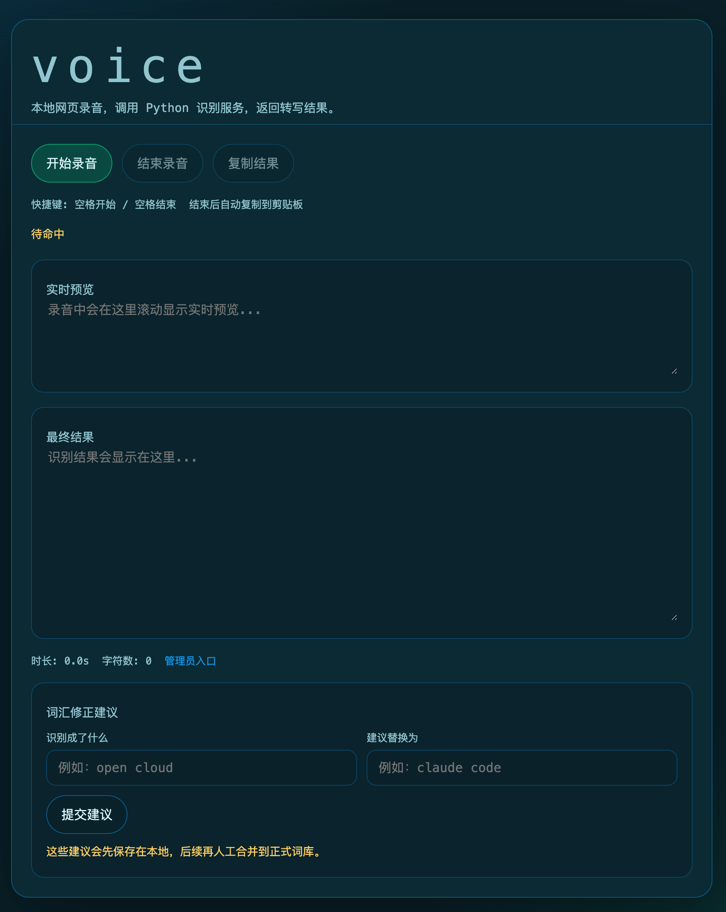

# voiceinput

[](https://github.com/dundeyu/voiceinput/actions/workflows/ci.yml)
[](LICENSE)
[](https://www.python.org/)
[](https://www.apple.com/macos/)

一个面向 macOS 的本地语音输入工具，支持终端模式、桌面全局热键模式和本地网页模式。按下快捷键开始录音，结束后自动进行语音识别，并将结果复制或粘贴回当前输入位置。

## Screenshot

当前终端界面示意：


当前 Web 界面示意：



项目目前默认通过全局 `voice` 命令使用，也可以直接运行 `python main.py`。

## Features

- 本地离线识别，默认不依赖在线服务
- 面向终端的键盘交互界面
- 支持桌面全局热键输入与悬浮预览
- 录音结束后自动复制识别结果到剪贴板
- 支持中文、英文、日文切换
- 支持口语词过滤和词汇纠错
- 尽量减少直接三方依赖，便于本地安装
- 包含可直接执行的 `pytest` 回归测试

## Requirements

- macOS
- Python 3.10+
- 可用麦克风权限
- 经过验证的 `funasr==1.3.1`

## Quick Start

```bash
git clone https://github.com/dundeyu/voiceinput.git
cd voiceinput
python3 -m venv venv
source venv/bin/activate
pip install -r requirements-dev.txt
pip install -e .
voice
```

如果你想直接测试桌面全局热键模式，也可以把最后一步换成：

```bash
voice-desktop
```

首次启动时如果本地没有模型，程序会自动从 ModelScope 获取并缓存到 `~/.cache/modelscope/hub/models/`。通常不需要先手动准备 `models/` 目录。

首次下载体积说明：

- ASR 默认模型首次下载约 `2 GB`
- VAD 模型首次下载约 `4 MB`
- 首次启动可能会花几分钟，后续会直接复用缓存

## Global `voice` Command

如果你希望通过标准安装方式获得全局 `voice` 命令，推荐直接：

```bash
pip install -e .
```

如果你更想用脚本方式，也可以把 [bin/voice](bin/voice) 链接到 PATH 中：

```bash
chmod +x bin/voice
ln -sf "$(pwd)/bin/voice" /usr/local/bin/voice
```

如果你的环境使用 Homebrew 的路径，也可以链接到：

```bash
ln -sf "$(pwd)/bin/voice" /opt/homebrew/bin/voice
```

脚本会自动根据自身位置解析项目根目录，不依赖作者机器上的固定绝对路径。

## Usage

启动后支持以下操作：

- `[空格]`：开始或停止录音
- `[L]`：切换识别语言
- `[S]`：直接识别当前 `temp/stream_recording.wav`，便于调试流式缓存内容
- `[Q]`：退出程序

建议完整说完一句话后再结束录音，识别结果会自动复制到剪贴板。

## Desktop Version

桌面全局热键版本可以这样启动：

```bash
voice-desktop
```

默认交互：

- `Option + Space`：开始录音
- 再按一次 `Option + Space`：结束录音
- 识别完成后会自动粘贴到当前输入位置
- 悬浮窗会显示实时预览，并在成功粘贴后显示 `本次 / 今日 / 累计`

权限要求：

- 麦克风权限
- 辅助功能权限

说明：

- 当前如果目标应用能暴露更细的焦点信息，悬浮窗会尽量贴近输入区域
- 如果目标应用不暴露输入框或光标位置，悬浮窗会稳定回退到当前屏幕中间
- 桌面模式复用与 `voice` 相同的统计口径和模型加载逻辑

## Web Version

本地网页版本可以这样启动：

```bash
voice-web
```

默认只监听本机：

- [http://127.0.0.1:8765](http://127.0.0.1:8765)
- 支持空格开始 / 空格结束
- 结束后会自动复制识别结果到浏览器剪贴板
- 页面底部可提交“词汇修正建议”，会先进入本地建议箱
- 如果这些参数已经写进 `config/settings.yaml` 的 `web` 段，直接运行 `voice-web` 即可

如果你想让局域网里的其它机器也能访问，可以这样启动：

```bash
voice-web --host 0.0.0.0 --port 8765 --workers 2
```

说明：

- `--host 0.0.0.0`：允许局域网访问
- `--workers 2`：启动 2 个识别 worker，更适合多人同时使用
- 启动后终端会打印本机可访问的局域网地址

注意：

- worker 越多，模型会加载越多份，内存占用也会增加
- 如果 macOS 防火墙拦截了 Python 或终端，局域网访问会失败

如果你想把网页服务挂到后台运行，可以这样启动：

```bash
voice-web --host 0.0.0.0 --port 8765 --workers 2 --daemon
```

默认会把后台信息写到：

- `logs/voice-web.pid`
- `logs/voice-web.stdout.log`
- `logs/voice-web.stderr.log`

命令行参数会覆盖 `config/settings.yaml` 里的 `web` 默认值。

管理员配置页：

- 入口：`/admin`
- 需要管理员密码登录后才能进入配置页
- 可维护默认语言、设备、Web 服务参数、语气词、正式替换词
- 可查看最近的“词汇修正建议”，并对每条建议执行“采纳”或“删除”

说明：

- `采纳`：会把建议写入正式 `vocabulary_corrections`，并从建议箱移除
- `删除`：只会从建议箱移除，不会进入正式配置
- 建议箱默认保存在 `logs/vocabulary_suggestions.jsonl`

## Setup Details

默认配置见 [config/settings.yaml](config/settings.yaml)。

- `model.path` 默认留空，表示自动解析默认 ASR 模型
- `vad_model_path` 默认留空，表示自动解析 VAD 缓存或联网下载
- 离线模式默认关闭，首次启动更适合保持联网
- `web.host` / `web.port` / `web.workers` / `web.daemon` 可为 `voice-web` 提供默认启动参数
- 如果你想完全离线运行，也可以手动把模型放到项目目录或任意绝对路径
- `voice-desktop` 默认使用 `Option + Space` 作为全局热键

如果你要给别人分发配置，建议从 [config/settings.example.yaml](config/settings.example.yaml) 复制一份为 `config/settings.yaml` 再修改：

```bash
cp config/settings.example.yaml config/settings.yaml
```

当前项目对 `funasr` 的内部实现有少量耦合，因此依赖版本固定为 `funasr==1.3.1`。如果你想升级 `funasr`，建议先完整跑一遍测试和实际录音验证。

## Configuration

主配置文件是 [config/settings.yaml](config/settings.yaml)。

一个最小可用示例：

```json
{
  "offline_mode": false,
  "vad_model_path": "",
  "model": {
    "path": "models/FunAudioLLM/Fun-ASR-Nano-2512",
    "device": "",
    "default_language": "中文",
    "supported_languages": ["中文", "英文", "日文"]
  },
  "audio": {
    "input_sample_rate": 48000,
    "target_sample_rate": 16000,
    "channels": 1,
    "dtype": "float32"
  },
  "logging": {
    "level": "INFO",
    "format": "%(asctime)s - %(name)s - %(levelname)s - %(message)s",
    "file": "logs/voice_input.log",
    "console": false
  },
  "temp": {
    "audio_dir": "temp",
    "audio_filename": "recording.wav"
  },
  "web": {
    "host": "127.0.0.1",
    "port": 8765,
    "workers": 1,
    "daemon": false
  },
  "filler_words": ["呃", "嗯", "啊"],
  "vocabulary_corrections": {}
}
```

常见配置项：

- `offline_mode`：是否禁止联网下载模型，默认关闭，首次启动更适合保持联网
- `vad_model_path`：可选本地 VAD 模型路径，留空时会自动解析缓存目录或联网下载
- `model.path`：可选本地 ASR 模型路径
- `model.device`：运行设备，留空时默认优先 `mps`，其次 `cuda`，最后回退到 `cpu`
- `logging.console`：是否将日志输出到终端
- `web.host`：`voice-web` 默认监听地址
- `web.port`：`voice-web` 默认端口
- `web.workers`：`voice-web` 默认 worker 数量
- `web.daemon`：`voice-web` 默认是否后台运行
- `filler_words`：需要过滤的口语词
- `vocabulary_corrections`：易错词替换规则

模型缓存说明：

- 首次联网下载的 ASR / VAD 模型会缓存到 `~/.cache/modelscope/hub/models/`
- 程序会直接复用这份缓存，不会自动再复制到项目目录下的 `models/`
- 如果你清理掉这份缓存，下次启动时会重新联网下载
- 只有在明确想节省磁盘空间时，才建议手动清理 `~/.cache/modelscope/`

## Testing

安装开发依赖后运行：

```bash
venv/bin/python -m pytest tests
```

GitHub Actions 会在 macOS 环境自动执行同样的测试流程，配置见 [.github/workflows/ci.yml](.github/workflows/ci.yml)。

当前测试覆盖：

- 文本后处理
- 启动辅助逻辑
- 运行时 UI helper
- 录音会话辅助逻辑
- 运行时对象装配

## Troubleshooting

### 启动后模型加载失败

检查：

- `config/settings.yaml` 中的模型路径是否存在
- 离线模式下本地模型是否完整
- 如果 `vad_model_path` 已手动指定，检查它指向的 VAD 模型目录是否已经准备好

### 无法复制到剪贴板

当前实现依赖 macOS 自带的 `pbcopy`。如果你在非 macOS 环境运行，需要自行适配剪贴板实现。

### 没有录音输入

检查：

- 终端是否有麦克风权限
- 系统输入设备是否正常
- 当前采样率配置是否兼容你的设备

### 桌面热键没有响应

检查：

- 运行 `voice-desktop` 的终端是否已授予“辅助功能”
- 终端是否已授予“麦克风”
- 修改权限后是否已经完全退出并重新打开终端

## Development

- 入口文件：`main.py`
- 核心模块：`src/`
- 配置文件：`config/settings.yaml`
- 测试目录：`tests/`
- 打包配置：`pyproject.toml`
- GitHub 协作模板：`.github/`
- 版本记录：[CHANGELOG.md](CHANGELOG.md)

提交前建议至少执行：

```bash
venv/bin/python -m pytest tests
```

如果你准备公开仓库，建议保留当前的 issue / PR 模板，这会明显改善协作质量和问题收集质量。

## Acknowledgements

本项目站在许多优秀开源组件之上，特别感谢它们的作者和维护者持续投入：

- [FunASR](https://github.com/modelscope/FunASR) 提供核心语音识别能力
- [ModelScope](https://modelscope.cn/) 提供模型分发与缓存支持
- [openai-whisper](https://github.com/openai/whisper) 提供 tokenizer 相关能力
- [PyTorch](https://pytorch.org/) 与 [torchaudio](https://pytorch.org/audio/stable/index.html) 提供底层推理与音频处理基础

没有这些项目的工作，`voiceinput` 不会这么快落地。

## License

本项目使用 MIT License。详见 [LICENSE](LICENSE)。
