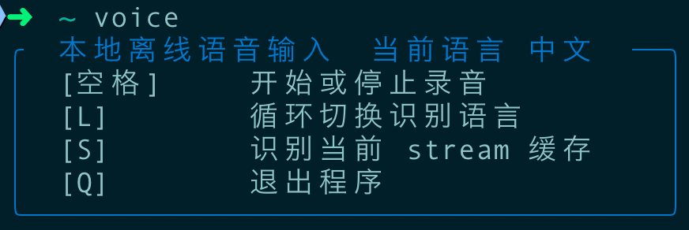

# voiceinput

[](https://github.com/dundeyu/voiceinput/actions/workflows/ci.yml)
[](LICENSE)
[](https://www.python.org/)
[](https://www.apple.com/macos/)

一个面向 macOS 终端的本地离线语音输入工具。按下快捷键开始录音，结束后自动进行语音识别，并将结果复制到系统剪贴板。

## Screenshot

当前终端界面示意：



项目目前默认通过全局 `voice` 命令使用，也可以直接运行 `python main.py`。

## Features

- 本地离线识别，默认不依赖在线服务
- 面向终端的键盘交互界面
- 录音结束后自动复制识别结果到剪贴板
- 支持中文、英文、日文切换
- 支持口语词过滤和词汇纠错
- 尽量减少直接三方依赖，便于本地安装
- 包含可直接执行的 `pytest` 回归测试

## Requirements

- macOS
- Python 3.10+
- 可用麦克风权限
- 经过验证的 `funasr==1.3.1`

## Quick Start

```bash
git clone https://github.com/dundeyu/voiceinput.git
cd voiceinput
python3 -m venv venv
source venv/bin/activate
pip install -r requirements-dev.txt
pip install -e .
voice
```

首次启动时如果本地没有模型，程序会自动从 ModelScope 获取并缓存到 `~/.cache/modelscope/hub/models/`。通常不需要先手动准备 `models/` 目录。

首次下载体积说明：

- ASR 默认模型首次下载约 `2 GB`
- VAD 模型首次下载约 `4 MB`
- 首次启动可能会花几分钟，后续会直接复用缓存

## Global `voice` Command

如果你希望通过标准安装方式获得全局 `voice` 命令，推荐直接：

```bash
pip install -e .
```

如果你更想用脚本方式，也可以把 [bin/voice](bin/voice) 链接到 PATH 中：

```bash
chmod +x bin/voice
ln -sf "$(pwd)/bin/voice" /usr/local/bin/voice
```

如果你的环境使用 Homebrew 的路径，也可以链接到：

```bash
ln -sf "$(pwd)/bin/voice" /opt/homebrew/bin/voice
```

脚本会自动根据自身位置解析项目根目录，不依赖作者机器上的固定绝对路径。

## Usage

启动后支持以下操作：

- `[空格]`：开始或停止录音
- `[L]`：切换识别语言
- `[S]`：直接识别当前 `temp/stream_recording.wav`，便于调试流式缓存内容
- `[Q]`：退出程序

建议完整说完一句话后再结束录音，识别结果会自动复制到剪贴板。

## Setup Details

默认配置见 [config/settings.yaml](config/settings.yaml)。

- `model.path` 默认留空，表示自动解析默认 ASR 模型
- `vad_model_path` 默认留空，表示自动解析 VAD 缓存或联网下载
- 离线模式默认关闭，首次启动更适合保持联网
- 如果你想完全离线运行，也可以手动把模型放到项目目录或任意绝对路径

如果你要给别人分发配置，建议从 [config/settings.example.yaml](config/settings.example.yaml) 复制一份为 `config/settings.yaml` 再修改：

```bash
cp config/settings.example.yaml config/settings.yaml
```

当前项目对 `funasr` 的内部实现有少量耦合，因此依赖版本固定为 `funasr==1.3.1`。如果你想升级 `funasr`，建议先完整跑一遍测试和实际录音验证。

## Configuration

主配置文件是 [config/settings.yaml](config/settings.yaml)。

一个最小可用示例：

```json
{
  "offline_mode": false,
  "vad_model_path": "",
  "model": {
    "path": "models/FunAudioLLM/Fun-ASR-Nano-2512",
    "device": "",
    "default_language": "中文",
    "supported_languages": ["中文", "英文", "日文"]
  },
  "audio": {
    "input_sample_rate": 48000,
    "target_sample_rate": 16000,
    "channels": 1,
    "dtype": "float32"
  },
  "logging": {
    "level": "INFO",
    "format": "%(asctime)s - %(name)s - %(levelname)s - %(message)s",
    "file": "logs/voice_input.log",
    "console": false
  },
  "temp": {
    "audio_dir": "temp",
    "audio_filename": "recording.wav"
  },
  "filler_words": ["呃", "嗯", "啊"],
  "vocabulary_corrections": {}
}
```

常见配置项：

- `offline_mode`：是否禁止联网下载模型，默认关闭，首次启动更适合保持联网
- `vad_model_path`：可选本地 VAD 模型路径，留空时会自动解析缓存目录或联网下载
- `model.path`：可选本地 ASR 模型路径
- `model.device`：运行设备，留空时默认优先 `mps`，其次 `cuda`，最后回退到 `cpu`
- `logging.console`：是否将日志输出到终端
- `filler_words`：需要过滤的口语词
- `vocabulary_corrections`：易错词替换规则

模型缓存说明：

- 首次联网下载的 ASR / VAD 模型会缓存到 `~/.cache/modelscope/hub/models/`
- 程序会直接复用这份缓存，不会自动再复制到项目目录下的 `models/`
- 如果你清理掉这份缓存，下次启动时会重新联网下载
- 只有在明确想节省磁盘空间时，才建议手动清理 `~/.cache/modelscope/`

## Testing

安装开发依赖后运行：

```bash
venv/bin/python -m pytest tests
```

GitHub Actions 会在 macOS 环境自动执行同样的测试流程，配置见 [.github/workflows/ci.yml](.github/workflows/ci.yml)。

当前测试覆盖：

- 文本后处理
- 启动辅助逻辑
- 运行时 UI helper
- 录音会话辅助逻辑
- 运行时对象装配

## Troubleshooting

### 启动后模型加载失败

检查：

- `config/settings.yaml` 中的模型路径是否存在
- 离线模式下本地模型是否完整
- 如果 `vad_model_path` 已手动指定，检查它指向的 VAD 模型目录是否已经准备好

### 无法复制到剪贴板

当前实现依赖 macOS 自带的 `pbcopy`。如果你在非 macOS 环境运行，需要自行适配剪贴板实现。

### 没有录音输入

检查：

- 终端是否有麦克风权限
- 系统输入设备是否正常
- 当前采样率配置是否兼容你的设备

## Development

- 入口文件：`main.py`
- 核心模块：`src/`
- 配置文件：`config/settings.yaml`
- 测试目录：`tests/`
- 打包配置：`pyproject.toml`
- GitHub 协作模板：`.github/`
- 版本记录：[CHANGELOG.md](CHANGELOG.md)

提交前建议至少执行：

```bash
venv/bin/python -m pytest tests
```

如果你准备公开仓库，建议保留当前的 issue / PR 模板，这会明显改善协作质量和问题收集质量。

## Acknowledgements

本项目站在许多优秀开源组件之上，特别感谢它们的作者和维护者持续投入：

- [FunASR](https://github.com/modelscope/FunASR) 提供核心语音识别能力
- [ModelScope](https://modelscope.cn/) 提供模型分发与缓存支持
- [openai-whisper](https://github.com/openai/whisper) 提供 tokenizer 相关能力
- [PyTorch](https://pytorch.org/) 与 [torchaudio](https://pytorch.org/audio/stable/index.html) 提供底层推理与音频处理基础

没有这些项目的工作，`voiceinput` 不会这么快落地。

## License

本项目使用 MIT License。详见 [LICENSE](LICENSE)。
